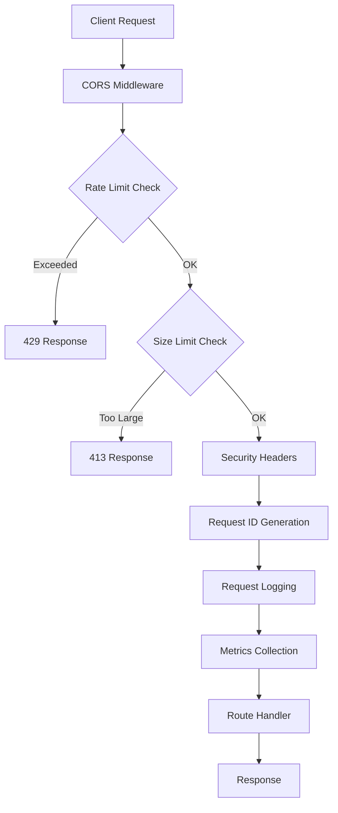
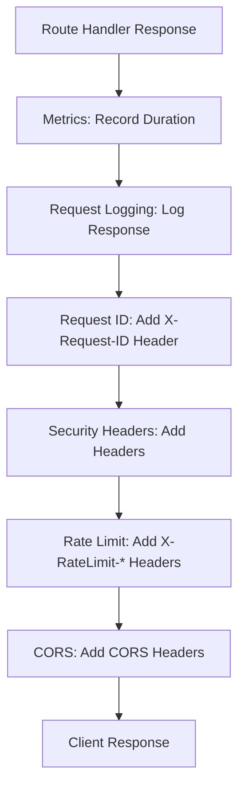
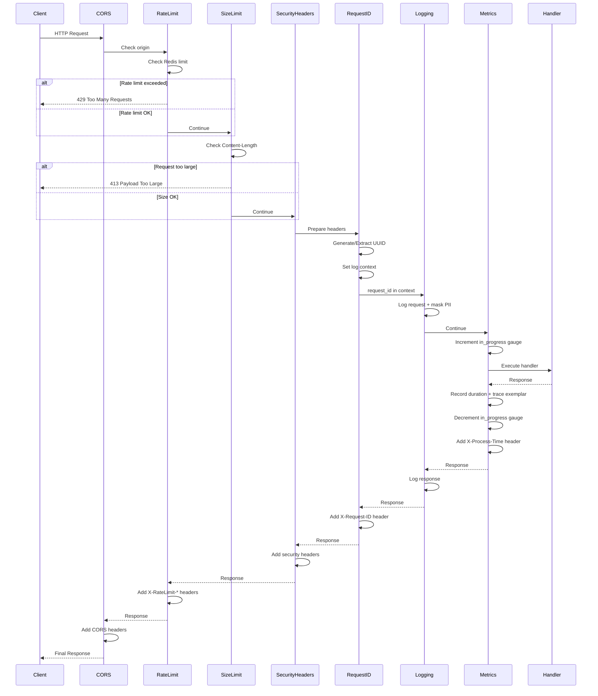
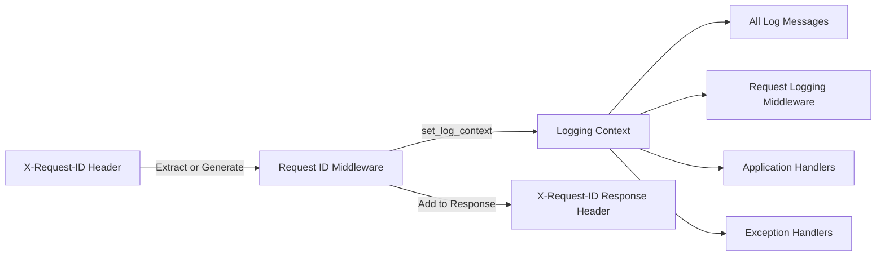
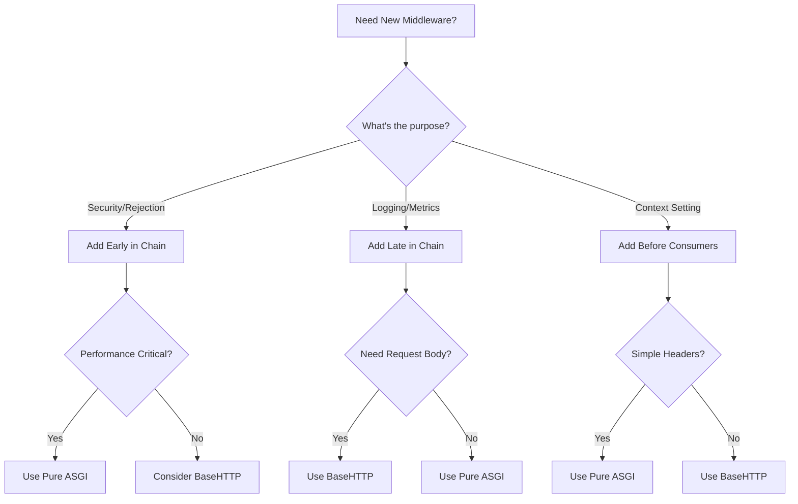

# Middleware Architecture

This document provides comprehensive documentation of the FastAPI middleware stack, including architecture patterns, execution order, performance characteristics, and integration with observability tools.

## Table of Contents

- [Overview](#overview)
- [Middleware Stack](#middleware-stack)
- [Execution Order](#execution-order)
- [Pure ASGI vs BaseHTTPMiddleware](#pure-asgi-vs-basehttpmiddleware)
- [Request Flow](#request-flow)
- [Context Propagation](#context-propagation)
- [Observability Integration](#observability-integration)
- [Adding New Middleware](#adding-new-middleware)
- [Configuration](#configuration)
- [Performance Considerations](#performance-considerations)

## Overview

The application uses a carefully designed middleware stack to handle cross-cutting concerns including:

- **Security**: Request size limits, rate limiting, security headers
- **Observability**: Request IDs, metrics collection, distributed tracing
- **Logging**: Detailed request/response logging with PII masking
- **API Documentation**: CORS configuration for development and production

The middleware stack consists of **7 middleware layers** (6 custom + CORS), each serving a specific purpose and positioned strategically in the execution chain.

## Middleware Stack

### 1. CORS Middleware (Outermost)
**Type**: FastAPI Built-in
**Purpose**: Handle Cross-Origin Resource Sharing for browser-based clients
**Configuration**: `AppSettings.cors_*` settings

Handles preflight requests and injects CORS headers for allowed origins.

### 2. Rate Limit Middleware (Optional)
**Type**: Pure ASGI
**Purpose**: Protect against DDoS and abuse with Redis-backed rate limiting
**Configuration**: `AppSettings.enable_rate_limiting`, `rate_limit_per_minute`
**Requirements**: Redis connection

Implements token bucket algorithm for distributed rate limiting across service instances.

### 3. Request Size Limit Middleware
**Type**: Pure ASGI
**Purpose**: Prevent DoS attacks via large payloads
**Configuration**: `AppSettings.request_size_limit` (default: 10MB)

Checks Content-Length header and rejects oversized requests before reading the body.

### 4. Security Headers Middleware
**Type**: Pure ASGI
**Purpose**: Add security headers to prevent common web vulnerabilities
**Configuration**: Environment-aware (stricter in production)

Protects against XSS, clickjacking, MIME sniffing, and other OWASP Top 10 risks.

### 5. Request ID Middleware
**Type**: Pure ASGI
**Purpose**: Generate/extract unique request IDs for distributed tracing
**Configuration**: `LoggingSettings.include_request_id`

Sets request ID in logging context immediately, making it available to all downstream middleware and handlers.

### 6. Request Logging Middleware (Debug Only)
**Type**: BaseHTTPMiddleware
**Purpose**: Detailed request/response logging with PII masking
**Configuration**: Enabled when `debug=True` or `log_level=DEBUG`

Logs HTTP details while automatically masking sensitive information (emails, tokens, credit cards, etc.).

### 7. Metrics Middleware
**Type**: BaseHTTPMiddleware
**Purpose**: Collect Prometheus metrics with trace correlation
**Configuration**: `OtelSettings.is_configured`

Records request counts, durations, and in-progress gauges. Links metrics to traces via exemplars for Grafana click-through.

## Execution Order

**Critical concept**: In FastAPI/Starlette, middleware is executed in **reverse registration order**. The last middleware registered is the **outermost** layer and executes first.

### Registration Order (in `configure_middleware()`)

```python
# Last registered = First to execute
1. CORS                    # Outermost
2. Rate Limit (optional)   # Early rejection for DDoS
3. Request Size Limit      # Early rejection for large payloads
4. Security Headers        # Add security headers to all responses
5. Request ID              # Generate ID, set logging context
6. Request Logging         # Detailed logging (requires request_id)
7. Metrics                 # Innermost - closest to route handlers
```

### Execution Flow (Request Path)



### Execution Flow (Response Path)



### Why This Order Matters

1. **CORS First**: Browsers need CORS headers on all responses, including errors
2. **Rate Limit Early**: Fast rejection before expensive processing
3. **Size Limit Early**: Prevent reading large request bodies into memory
4. **Security Headers**: Applied to all responses including errors
5. **Request ID Before Logging**: Logs need request_id in context
6. **Logging Before Metrics**: Capture full request details for debugging
7. **Metrics Innermost**: Measure actual handler execution time

## Pure ASGI vs BaseHTTPMiddleware

### Performance Comparison

Pure ASGI middleware provides **40-50% better performance** than BaseHTTPMiddleware by:

- Avoiding unnecessary Request/Response object creation
- Working directly with ASGI messages
- Reducing memory allocations
- Eliminating serialization overhead

### Implementation Patterns

#### Pure ASGI Middleware Pattern

```python
class RequestIDMiddleware:
    """Pure ASGI middleware for maximum performance."""

    def __init__(self, app: ASGIApp) -> None:
        self.app = app

    async def __call__(self, scope: Scope, receive: Receive, send: Send) -> None:
        # Only process HTTP requests
        if scope["type"] != "http":
            await self.app(scope, receive, send)
            return

        # Extract data from scope
        headers = dict(scope.get("headers", []))
        request_id = headers.get(b"x-request-id", b"").decode("latin-1")

        # Wrap send to modify response
        async def send_with_header(message: dict) -> None:
            if message["type"] == "http.response.start":
                headers = MutableHeaders(scope=message)
                headers.append("X-Request-ID", request_id)
            await send(message)

        await self.app(scope, receive, send_with_header)
```

**Pros:**
- 40-50% faster than BaseHTTPMiddleware
- Lower memory usage
- Better for high-throughput scenarios

**Cons:**
- More complex implementation
- Manual header manipulation
- Need to handle ASGI message types

#### BaseHTTPMiddleware Pattern

```python
class MetricsMiddleware(BaseHTTPMiddleware):
    """BaseHTTPMiddleware for convenience when performance impact is acceptable."""

    async def dispatch(self, request: Request, call_next: Callable) -> Response:
        start_time = time.time()

        # Process request
        response = await call_next(request)

        # Record metrics
        duration = time.time() - start_time
        record_metric(duration)

        return response
```

**Pros:**
- Simpler implementation
- Direct access to Request/Response objects
- Easier to read and maintain
- Good for complex logic requiring request parsing

**Cons:**
- ~40-50% performance overhead
- Higher memory usage
- Additional serialization costs

### Decision Matrix

Use **Pure ASGI** when:
- Middleware runs on every request
- Performance is critical (rate limiting, size checks)
- Simple header manipulation
- Early rejection patterns

Use **BaseHTTPMiddleware** when:
- Complex request/response body parsing required
- Request body needs to be read and processed
- Performance impact is acceptable
- Code clarity outweighs performance concerns

### Current Implementation Choices

| Middleware | Type | Rationale |
|-----------|------|-----------|
| CORS | Built-in | Framework provided |
| Rate Limit | Pure ASGI | Early rejection, runs on every request |
| Size Limit | Pure ASGI | Early rejection, simple header check |
| Security Headers | Pure ASGI | Runs on every request, simple header injection |
| Request ID | Pure ASGI | Runs on every request, minimal processing |
| Request Logging | BaseHTTP | Complex body parsing and PII masking |
| Metrics | BaseHTTP | Needs request context, timing convenience |

## Request Flow

### Complete Request Journey



## Context Propagation

### Request ID Flow

The request ID is a unique identifier that flows through the entire request lifecycle, enabling correlation across logs, metrics, and traces.



### Implementation Details

```python
# 1. Request ID Middleware extracts/generates ID
request_id = headers.get(b"x-request-id")
if request_id:
    request_id = request_id.decode("latin-1")
else:
    request_id = str(uuid.uuid4())

# 2. Store in scope state for handler access
scope["state"]["request_id"] = request_id

# 3. Set logging context immediately
set_log_context(request_id=request_id)

# 4. All subsequent logs include request_id
logger.info("Processing request")  # Automatically includes request_id

# 5. Cleanup context after request
try:
    await self.app(scope, receive, send_with_request_id)
finally:
    clear_log_context()  # Prevent context leakage
```

### Accessing Request ID in Handlers

```python
from fastapi import Request

async def my_handler(request: Request):
    # Access from request state
    request_id = request.state.request_id

    # Or get from logging context
    from example_service.infra.logging.context import get_log_context
    context = get_log_context()
    request_id = context.get("request_id")
```

## Observability Integration

### OpenTelemetry Tracing

The middleware stack integrates with OpenTelemetry for distributed tracing:

1. **Automatic Instrumentation**: FastAPIInstrumentor creates spans for all HTTP requests
2. **Trace Context Propagation**: W3C Trace Context headers (`traceparent`, `tracestate`)
3. **Span Enrichment**: Request ID, HTTP method, path, status code added as attributes
4. **Exception Recording**: Exceptions automatically recorded in spans

### Prometheus Metrics with Exemplars

The Metrics middleware links metrics to traces using **exemplars**:

```python
# Extract current trace ID
span = trace.get_current_span()
if span and span.get_span_context().is_valid:
    trace_id = format(span.get_span_context().trace_id, "032x")

# Record metric with exemplar
http_request_duration_seconds.labels(
    method=method,
    endpoint=endpoint
).observe(duration, exemplar={"trace_id": trace_id})
```

**Benefits:**
- Click-through from Grafana metrics to Tempo traces
- Correlate slow requests with detailed trace data
- Debug performance issues by jumping from aggregated metrics to specific traces

### Metrics Collected

```yaml
# Request metrics
http_requests_total{method, endpoint, status}           # Counter
http_request_duration_seconds{method, endpoint}         # Histogram
http_requests_in_progress{method, endpoint}             # Gauge

# Response timing
X-Process-Time: 0.123                                    # Response header
```

### Logging Structure

```json
{
  "timestamp": "2025-11-25T10:30:00.123Z",
  "level": "INFO",
  "message": "HTTP Request",
  "request_id": "550e8400-e29b-41d4-a716-446655440000",
  "method": "POST",
  "path": "/api/v1/reminders",
  "client_ip": "192.168.1.100",
  "headers": {
    "authorization": "********",
    "content-type": "application/json"
  },
  "body": {
    "email": "u***@example.com",
    "token": "********"
  }
}
```

## Adding New Middleware

### Decision Tree



### Implementation Checklist

- [ ] Determine middleware position in execution chain
- [ ] Choose Pure ASGI vs BaseHTTPMiddleware
- [ ] Implement proper error handling (fail open vs fail closed)
- [ ] Add configuration settings to `AppSettings`
- [ ] Update exempt paths if needed (`EXEMPT_PATHS`)
- [ ] Add metrics for middleware execution time (if applicable)
- [ ] Document configuration in this file
- [ ] Add tests for middleware behavior
- [ ] Update `configure_middleware()` function
- [ ] Consider impact on existing middleware

### Example: Adding Authentication Middleware

```python
# 1. Create middleware class
class AuthenticationMiddleware:
    """Verify JWT tokens and set user context."""

    def __init__(self, app: ASGIApp, jwt_secret: str):
        self.app = app
        self.jwt_secret = jwt_secret

    async def __call__(self, scope: Scope, receive: Receive, send: Send) -> None:
        if scope["type"] != "http":
            await self.app(scope, receive, send)
            return

        # Extract and verify token
        headers = dict(scope.get("headers", []))
        auth_header = headers.get(b"authorization", b"").decode("latin-1")

        user = None
        if auth_header.startswith("Bearer "):
            token = auth_header[7:]
            user = verify_jwt(token, self.jwt_secret)

        # Store user in scope state
        if "state" not in scope:
            scope["state"] = {}
        scope["state"]["user"] = user

        await self.app(scope, receive, send)

# 2. Register in configure_middleware()
def configure_middleware(app: FastAPI) -> None:
    # ... existing middleware ...

    # Add AFTER RequestID (needs context) but BEFORE Logging (uses user)
    if app_settings.enable_authentication:
        app.add_middleware(
            AuthenticationMiddleware,
            jwt_secret=app_settings.jwt_secret
        )
```

### Position Guidelines

| Purpose | Position | Reasoning |
|---------|----------|-----------|
| Request rejection (rate limit, size) | Early (position 2-3) | Fast rejection before processing |
| Context setting (request ID, auth) | Middle (position 4-5) | After rejection, before usage |
| Logging/metrics | Late (position 6-7) | Capture full request context |
| Response modification | Any | Runs on response path regardless |

## Configuration

### Environment Variables

```bash
# Middleware toggles
APP_ENABLE_RATE_LIMITING=true              # Enable rate limiting
APP_ENABLE_REQUEST_SIZE_LIMIT=true         # Enable size limits
APP_DEBUG=false                             # Enable request logging

# Rate limiting (requires Redis)
APP_RATE_LIMIT_PER_MINUTE=100              # Requests per minute
APP_RATE_LIMIT_WINDOW_SECONDS=60           # Window size

# Request size limits
APP_REQUEST_SIZE_LIMIT=10485760            # 10MB in bytes

# CORS
APP_CORS_ORIGINS='["https://example.com"]' # Allowed origins
APP_CORS_ALLOW_CREDENTIALS=true            # Allow credentials

# Logging
LOG_INCLUDE_REQUEST_ID=true                # Add request IDs to logs
LOG_LEVEL=INFO                             # Log level

# OpenTelemetry
OTEL_ENABLED=true                          # Enable tracing
OTEL_ENDPOINT=http://localhost:4317        # OTLP endpoint
```

### YAML Configuration

```yaml
# conf/app.yaml
app:
  environment: production
  debug: false

  # Middleware settings
  enable_rate_limiting: true
  rate_limit_per_minute: 1000
  rate_limit_window_seconds: 60

  enable_request_size_limit: true
  request_size_limit: 10485760  # 10MB

  # CORS
  cors_origins:
    - https://app.example.com
    - https://admin.example.com
  cors_allow_credentials: true
  cors_allow_methods:
    - GET
    - POST
    - PUT
    - DELETE
  cors_allow_headers:
    - Authorization
    - Content-Type
    - X-Request-ID

# conf/logging.yaml
logging:
  include_request_id: true
  level: INFO

# conf/otel.yaml
otel:
  enabled: true
  endpoint: http://tempo:4317
  service_name: example-service
  instrument_fastapi: true
  instrument_sqlalchemy: true
```

## Performance Considerations

### Middleware Overhead

Measured latency overhead per middleware (estimated):

| Middleware | Overhead | Type | Notes |
|-----------|----------|------|-------|
| CORS | <0.1ms | Built-in | Header manipulation only |
| Rate Limit | 1-3ms | Pure ASGI | Redis round trip |
| Size Limit | <0.1ms | Pure ASGI | Header check only |
| Security Headers | <0.1ms | Pure ASGI | Header manipulation |
| Request ID | <0.1ms | Pure ASGI | UUID generation + context |
| Request Logging | 1-5ms | BaseHTTP | Body parsing + PII masking |
| Metrics | 0.5-1ms | BaseHTTP | Trace lookup + recording |

**Total overhead**: ~2-10ms depending on configuration and request size.

### Optimization Tips

1. **Disable Request Logging in Production**: Use `debug=false` to skip expensive body logging
2. **Use Redis Connection Pooling**: Share Redis connections across rate limiting checks
3. **Tune Exempt Paths**: Add health check endpoints to `EXEMPT_PATHS` to skip middleware
4. **Optimize PII Masking**: Customize `PIIMasker.SENSITIVE_FIELDS` to only mask what's needed
5. **Consider Sampling**: Use OpenTelemetry sampling to reduce trace overhead

### Scalability Characteristics

- **Stateless Design**: All middleware can run across multiple instances
- **Redis-Based Rate Limiting**: Distributed limiting across instances
- **No Shared Memory**: Each request is independent
- **Async/Await**: Non-blocking I/O for Redis and database operations

### Memory Usage

- Pure ASGI middleware: **~1-2KB per request**
- BaseHTTPMiddleware: **~5-10KB per request** (Request/Response objects)
- Request logging (with body): **+10-50KB** depending on payload size

## Troubleshooting

### Common Issues

#### Request ID Not Appearing in Logs

**Symptom**: Logs missing `request_id` field

**Causes**:
1. Request ID middleware disabled: Check `LOG_INCLUDE_REQUEST_ID=true`
2. Middleware order wrong: RequestID must run before RequestLogging
3. Context not propagated: Verify `set_log_context()` is called

**Solution**:
```python
# Verify middleware order in configure_middleware()
if log_settings.include_request_id:
    app.add_middleware(RequestIDMiddleware)  # Must be before logging

if app_settings.debug:
    app.add_middleware(RequestLoggingMiddleware)  # Uses request_id
```

#### Rate Limiting Not Working

**Symptom**: No rate limiting applied, no X-RateLimit headers

**Causes**:
1. Redis not connected: Check Redis availability
2. Rate limiting disabled: Verify `APP_ENABLE_RATE_LIMITING=true`
3. Path is exempt: Check `EXEMPT_PATHS` list

**Solution**:
```bash
# Test Redis connection
redis-cli ping

# Check logs for rate limiting initialization
docker logs <container> | grep "Rate limiting enabled"

# Verify settings
python -c "from example_service.core.settings import get_app_settings; print(get_app_settings().enable_rate_limiting)"
```

#### Metrics Missing Trace Correlation

**Symptom**: Prometheus metrics don't have exemplars

**Causes**:
1. OpenTelemetry not configured: Check `OTEL_ENABLED=true`
2. Trace context not valid: Verify span is recording
3. Exemplar support disabled in Prometheus

**Solution**:
```python
# Add debug logging to MetricsMiddleware
span = trace.get_current_span()
if span and span.get_span_context().is_valid:
    logger.debug(f"Recording metric with trace_id: {trace_id}")
else:
    logger.warning("No valid trace context for exemplar")
```

### Performance Debugging

Monitor middleware execution time with metrics:

```python
# Add custom middleware timing metric
middleware_execution_time = Histogram(
    "middleware_execution_seconds",
    "Middleware execution time",
    ["middleware_name"],
    registry=REGISTRY
)

# Instrument middleware
start = time.time()
await self.app(scope, receive, send)
middleware_execution_time.labels(middleware_name="request_id").observe(time.time() - start)
```

## Related Documentation

- [Security Configuration](SECURITY_CONFIGURATION.md) - Detailed security settings and best practices
- [Database Architecture](DATABASE_ARCHITECTURE.md) - Database middleware and connection handling
- [Logging Configuration](example_service/infra/logging/README.md) - Logging context and PII masking

## References

- [FastAPI Middleware Documentation](https://fastapi.tiangolo.com/advanced/middleware/)
- [Starlette Middleware](https://www.starlette.io/middleware/)
- [OWASP Secure Headers Project](https://owasp.org/www-project-secure-headers/)
- [OpenTelemetry Python](https://opentelemetry.io/docs/languages/python/)
- [Prometheus Exemplars](https://prometheus.io/docs/prometheus/latest/feature_flags/#exemplars-storage)
